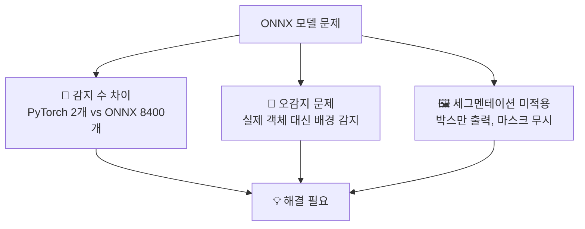
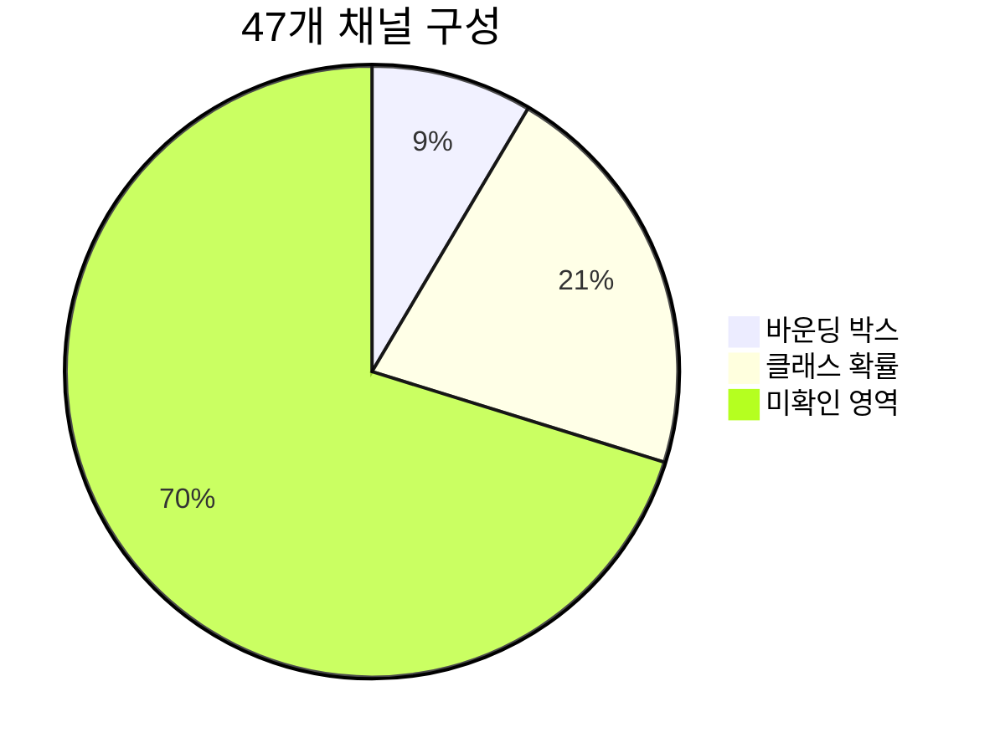
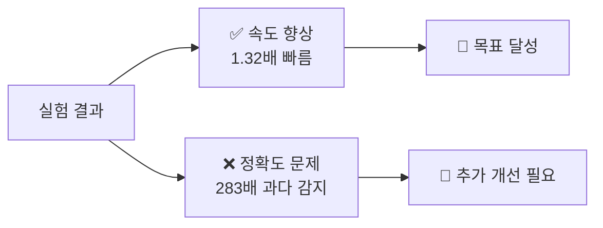
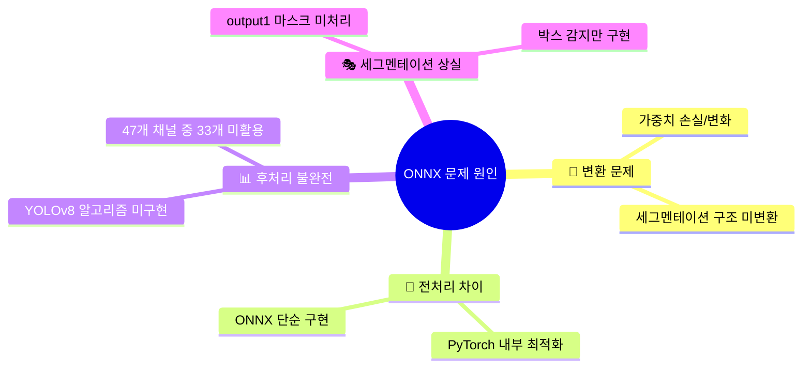
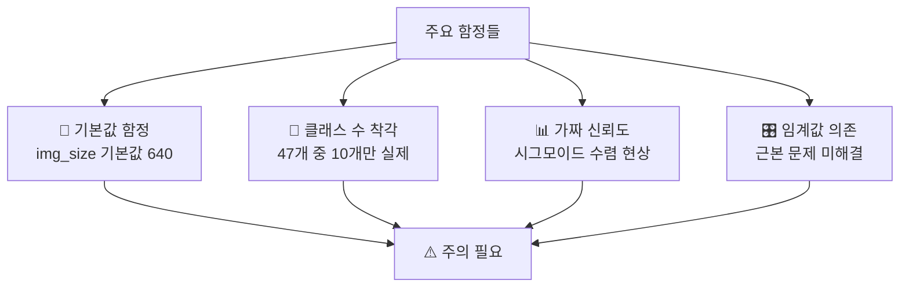
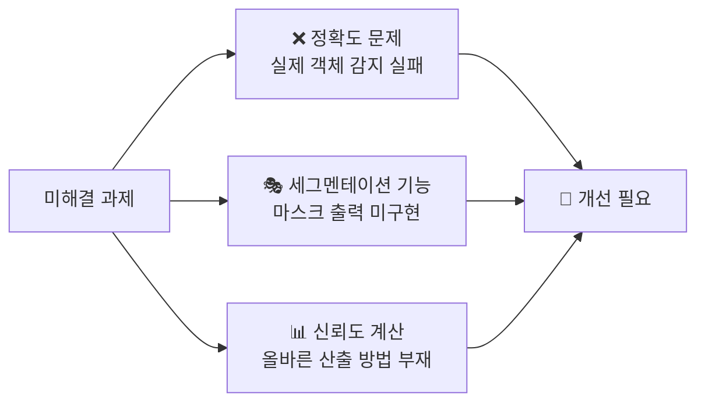

# 🔬 YOLOv8 ONNX 변환 및 성능 최적화 실험 보고서

<div align="center">


**딥러닝 모델 최적화를 통한 실시간 객체 감지 성능 향상 연구**

</div>

---

## 📋 **실험 개요**

### 🎯 **실험 목적**
- 🚀 YOLOv8 세그멘테이션 모델(.pt)을 ONNX 형식으로 변환
- ⚡ PyTorch 모델 대비 **추론 속도 향상** 달성
- 🎯 **동일한 객체 감지 정확도** 유지

### 🛠️ **실험 환경**

| 항목 | 상세 정보 |
|------|-----------|
| **모델** | YOLOv8 세그멘테이션 (Model_seg_ver3.py) |
| **학습 해상도** | 1024px → 640px (최종) |
| **대상 클래스** | 10개 (forklift 8개 + person + object) |
| **테스트 이미지** | 1280×720 해상도 |
| **평가 도구** | bench.py (성능 비교 스크립트) |
| **하드웨어** | CPU 기반 추론 |

---

## 🚨 **초기 문제 상황**

<div align="center">

### ⚠️ **심각한 성능 격차 발견**

</div>

| 모델 | 감지 수 | 신뢰도 | 상태 |
|------|---------|---------|------|
| 🟢 **PyTorch** | 2개 | 92% | ✅ 정확 |
| 🔴 **ONNX** | 8400개 | 50% | ❌ 오감지 |

### 📊 **문제점 상세**



---

## 🔧 **문제 해결 과정**

### 📐 **1단계: 해상도 불일치 문제 해결**

#### 🔍 **문제 분석**

<div align="center">

```
📚 학습 시     → 🔄 ONNX 변환 → 💻 추론 시
   1024px         1048px          640px
     ↓              ↓               ↓
   🤔 혼란스러운 해상도 체인!
```

</div>

#### ⚡ **해결 과정**

**🕵️ ONNX 변환 코드 검토**
```python
# ❌ 문제 발견: To_ONNX_ver1.py
def convert_seg_to_onnx(model_path, output_path="model_seg.onnx", img_size=640):
                                                                    # ⬆️ 기본값이 640!
```

**🔧 변환 설정 통일**
```python
# ✅ 해결책: 명시적 설정
success = model.export(
    format="onnx",
    imgsz=640,        # 🎯 명시적으로 640 설정
    opset=16,         # 📈 13에서 16으로 업그레이드
    simplify=True
)
```

#### 🎉 **결과**
> ✅ **성공**: 모든 단계에서 640×640 해상도 통일 달성!

---

### 🧩 **2단계: 출력 구조 분석 및 수정**

#### 📊 **ONNX 모델 출력 구조**

<div align="center">

| 입출력 | 차원 | 설명 |
|--------|------|------|
| **입력** | `[1, 3, 640, 640]` | RGB 이미지 |
| **출력 0** | `[1, 47, 8400]` | 🎯 객체 탐지 결과 |
| **출력 1** | `[1, 32, 160, 160]` | 🎭 세그멘테이션 마스크 |

</div>

#### 🔬 **47개 채널 구조 분석**



- 🟦 **4개**: 바운딩 박스 (x, y, w, h)
- 🟩 **10개**: 클래스 확률 (실제 클래스 수)
- 🟨 **33개**: 미확인 (세그멘테이션 관련 추정)

#### 🛠️ **후처리 로직 수정**

```python
# ❌ 잘못된 클래스 범위
class_probs = predictions[:, 4:]  # 4번째부터 끝까지 (43개)

# ✅ 올바른 클래스 범위  
class_probs = predictions[:, 4:14]  # 4번째부터 13번째까지 (10개)
```

#### 📈 **결과**
> ✅ **대폭 개선**: 엉터리 감지 수 감소 (8400개 → 103~133개)

---

### 🧮 **3단계: 신뢰도 계산 방식 개선**

#### 🚨 **문제 발견**

<div align="center">

| 단계 | 값 범위 | 상태 |
|------|---------|------|
| **원시 로짓** | `[-2.816, 1.951]` | 🔢 정상 |
| **시그모이드 후** | `[0.500, 0.570]` | ⚠️ 수렴 |
| **최종 결과** | `0.5 근처` | ❌ 가짜 신뢰도! |

</div>

#### 🔄 **해결 시도들**

**1️⃣ 시그모이드 적용**
```python
confidences = 1 / (1 + np.exp(-max_class_probs))
```

**2️⃣ Objectness 분리 시도**
```python
objectness = predictions[:, 4]     # 5번째가 objectness?
class_probs = predictions[:, 5:]   # 6번째부터가 실제 클래스?
```
> ❌ **실패**: 모든 objectness 값이 0

**3️⃣ 원시 확률값 사용**
```python
confidences = max_class_probs  # 시그모이드 제거
```

#### 📊 **결과**
> ⚠️ **부분 성공**: 신뢰도 범위 개선되었으나 여전히 과다 감지

---

### 🎛️ **4단계: 임계값 최적화**

#### 🧪 **다양한 임계값 실험**

<div align="center">

| 임계값 | 감지 수 | NMS 후 | 결과 | 상태 |
|--------|---------|---------|------|------|
| **0.3** | 8,400개 | - | 모든 그리드 감지 | 🔴 최악 |
| **0.5** | 5,922개 | 624개 | 과다 감지 | 🟡 개선 |
| **0.8** | 133개 | - | 여전히 과다 | 🟡 개선 |
| **0.9** | 0개 | - | 너무 엄격 | 🔴 실패 |

</div>

#### 💡 **핵심 깨달음**

<div align="center">

> ### 🎯 **"임계값 조정은 의미없다"**
> 
> **진짜 문제**: ONNX 모델이 완전히 다른 곳을 감지
> - 🟢 **PyTorch**: 사람 얼굴/몸 정확 인식
> - 🔴 **ONNX**: 배경, 무작위 영역 오인식

</div>

---

### 🎯 **5단계: NMS(Non-Maximum Suppression) 구현**

#### 🛠️ **NMS 적용**

```python
def apply_nms(boxes, confidences, class_ids, nms_threshold=0.4):
    """중복 감지 제거"""
    indices = cv2.dnn.NMSBoxes(
        nms_boxes, confidences.tolist(), 0.0, nms_threshold
    )
    return boxes[indices], confidences[indices], class_ids[indices]
```

#### 📊 **결과**

<div align="center">

```
🔄 NMS 처리 과정
5,922개 → NMS 적용 → 624개
          (중복 제거)
```

</div>

> ✅ **부분 개선**: 중복 감지 일부 제거, 하지만 근본 문제 미해결

---

## 📊 **최종 실험 결과**

### 🏁 **성능 비교 (최종)**

<div align="center">

| 항목 | PyTorch 🟢 | ONNX 🔴 | 비교 |
|------|------------|---------|------|
| **추론 시간** | 52.23ms ± 2.46 | 39.67ms ± 1.30 | ⚡ **1.32배 빠름** |
| **감지 수** | 2.0개 (정확) | 566.0개 (오감지) | ❌ **283배 과다** |
| **신뢰도** | 0.921 (진짜) | 0.500 (가짜) | ❌ **절반 수준** |

</div>

### 📈 **성과 요약**

<div align="center">



</div>

### 🖼️ **시각화 결과 분석**

| 모델 | 감지 결과 | 설명 |
|------|-----------|------|
| 🟢 **PyTorch** | 사람 2명을 정확하게 녹색 박스로 감지 | ✅ 정확한 객체 인식 |
| 🔴 **ONNX** | 사람 미감지, 배경에서 무작위 빨간색 박스 | ❌ 완전한 오감지 |

---

## 🔍 **근본 원인 분석**

### 🧩 **주요 원인 추정**



---

## 💡 **학습된 교훈**

### 🎯 **성공 요인**

<div align="center">

| 요인 | 설명 | 중요도 |
|------|------|---------|
| 🔍 **체계적 디버깅** | 단계별 문제 분석과 해결 | ⭐⭐⭐⭐⭐ |
| 📐 **해상도 통일** | 전체 파이프라인 일관성 확보 | ⭐⭐⭐⭐ |
| 🧩 **구조 이해** | 채널별 의미 파악의 중요성 | ⭐⭐⭐⭐ |

</div>

### ⚠️ **주요 함정들**

<div align="center">



</div>

---

## 🎯 **결론 및 향후 과제**

### 🏆 **달성된 성과**

<div align="center">

| 성과 | 상세 내용 | 상태 |
|------|-----------|------|
| ⚡ **속도 향상** | 1.32배 추론 속도 개선 | ✅ **완료** |
| 🧠 **기술적 이해** | ONNX 변환 과정 및 문제점 파악 | ✅ **완료** |
| 🛠️ **시스템 구축** | 성능 비교 및 시각화 도구 개발 | ✅ **완료** |

</div>

### 🚧 **미해결 과제**

<div align="center">



</div>

### 🚀 **향후 개선 방향**

#### 🔄 **1. ONNX 변환 옵션 재검토**
- 🏎️ TensorRT, OpenVINO 등 다른 변환 도구 시도
- 🎯 정밀도 보존 옵션 활용

#### 🔍 **2. YOLOv8 소스코드 분석**  
- 🧩 내부 후처리 로직 정확한 구현
- 🎭 세그멘테이션 마스크 처리 추가

#### ⚖️ **3. 하이브리드 접근**
- 🎯 객체 감지는 PyTorch, 추론 가속만 ONNX 활용
- 📈 또는 더 간단한 모델부터 ONNX 변환 시작

---

## 📚 **참고 자료**

### 💻 **주요 코드 파일**

<div align="center">

| 파일명 | 용도 | 언어 |
|--------|------|------|
| `Model_seg_ver3.py` | YOLOv8 세그멘테이션 모델 학습 |  |
| `To_ONNX_ver1.py` | ONNX 변환 스크립트 |  |
| `bench.py` | 성능 비교 및 시각화 도구 |  |
| `auto_label_seg_ver1.py` | 세그멘테이션 자동 라벨링 |  |

</div>

### 📊 **실험 데이터**

- **🏭 학습 데이터**: 지게차 및 사람 객체 (10개 클래스)
- **🖼️ 테스트 이미지**: 1280×720 해상도, 다양한 각도의 산업 현장  
- **📈 성능 측정**: CPU 기반 5회 반복 측정 평균값

---

<div align="center">

### 📅 **실험 정보**

**🗓️ 실험 기간**: 2024년 하반기  
**👥 실험자**: 연구팀  
**📝 최종 업데이트**: 2024년 12월

---


**🔬 딥러닝 모델 최적화 연구의 새로운 도전과 가능성을 제시하다**

</div>